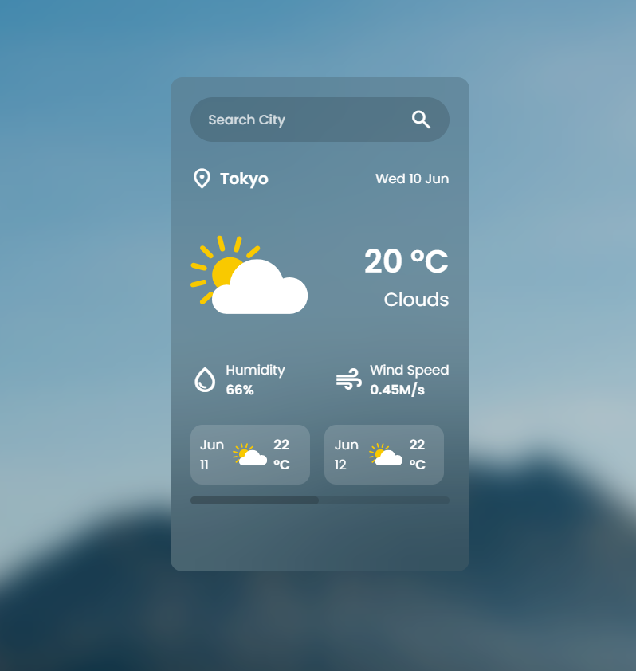

# Weather App 🌤️

A modern weather application built with HTML, CSS, and JavaScript that allows users to search for any city and view current weather conditions along with a multi-day forecast.

## Preview



> Replace `preview.png` with a screenshot of your project.

## Features

* Search weather by city name
* Display current temperature
* Show weather conditions
* Display humidity and wind speed
* 5-day weather forecast
* Responsive and modern UI
* Dynamic weather icons based on weather conditions
* Error handling for invalid city names

## Technologies Used

* HTML5
* CSS3
* JavaScript (ES6+)
* OpenWeather API
* Google Material Symbols

## Installation

1. Clone the repository:

```bash
git clone https://github.com/shaqayeqNz/weather-app.git
```

2. Open the project folder:

```bash
cd weather-app
```

3. Open `index.html` in your browser.

## API Setup

This project uses the OpenWeather API.

1. Create an account on OpenWeather.
2. Generate an API key.
3. Replace the API key inside `script.js`:

```javascript
const apiKey = "YOUR_API_KEY";
```

## Project Structure

```text
weather-app/
│
├── assets/
│   ├── weather/
│   ├── message/
│   |── bg.jpg
│   └──preview.png
│
├── index.html
├── style.css
├── script.js
└── README.md
```

## Future Improvements

* Geolocation support
* Dark/Light mode
* Hourly forecast
* Search history
* Temperature unit conversion (°C / °F)

## License

This project is open source and available under the MIT License.
